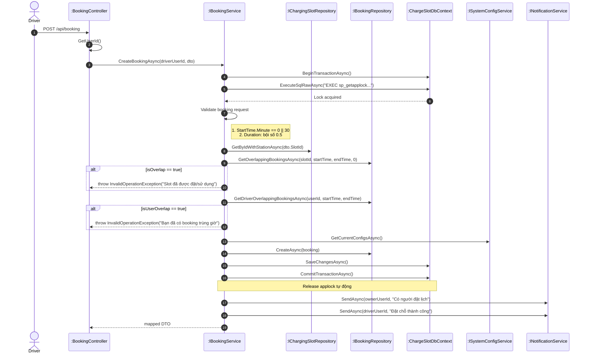
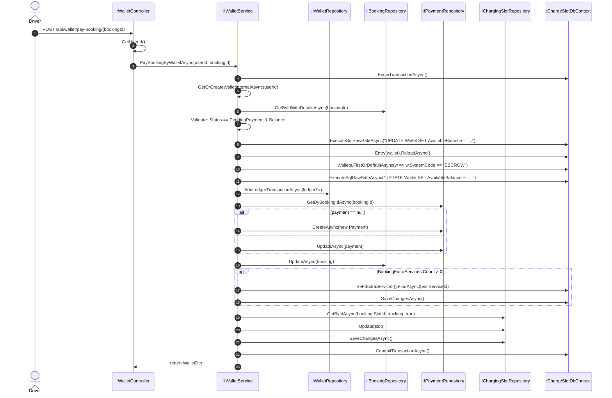
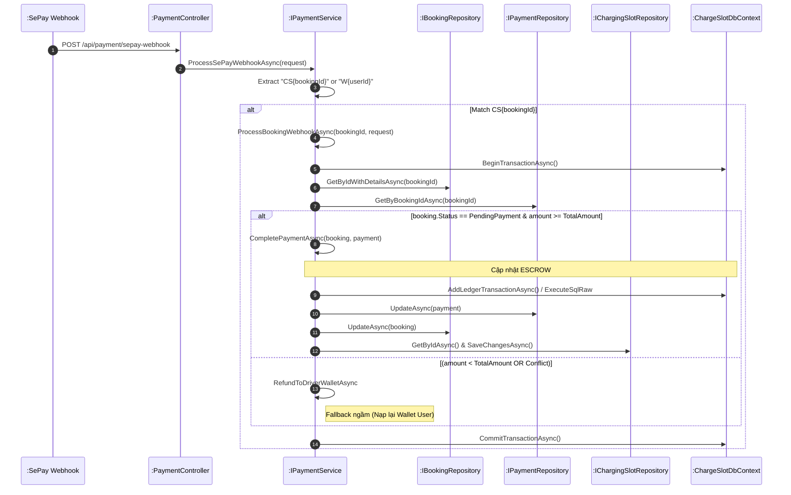
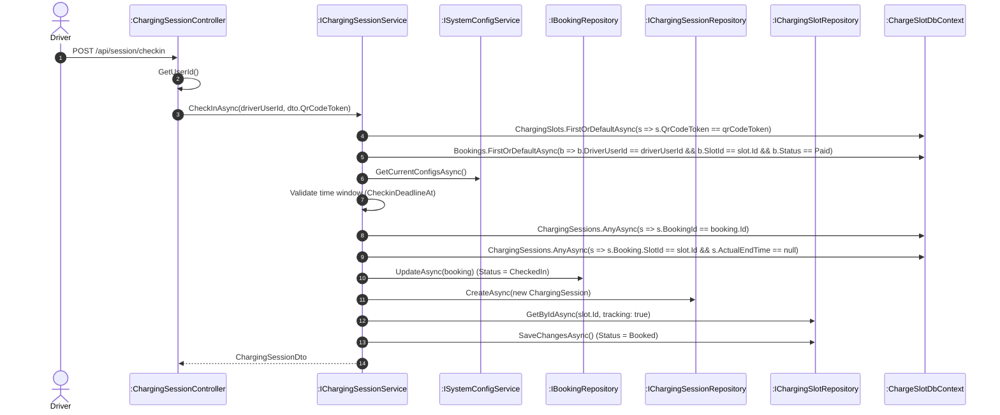
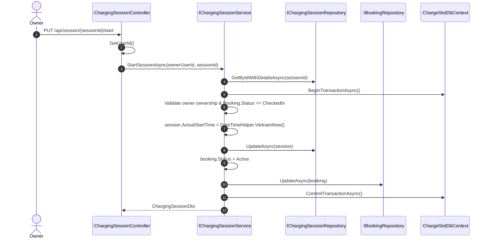
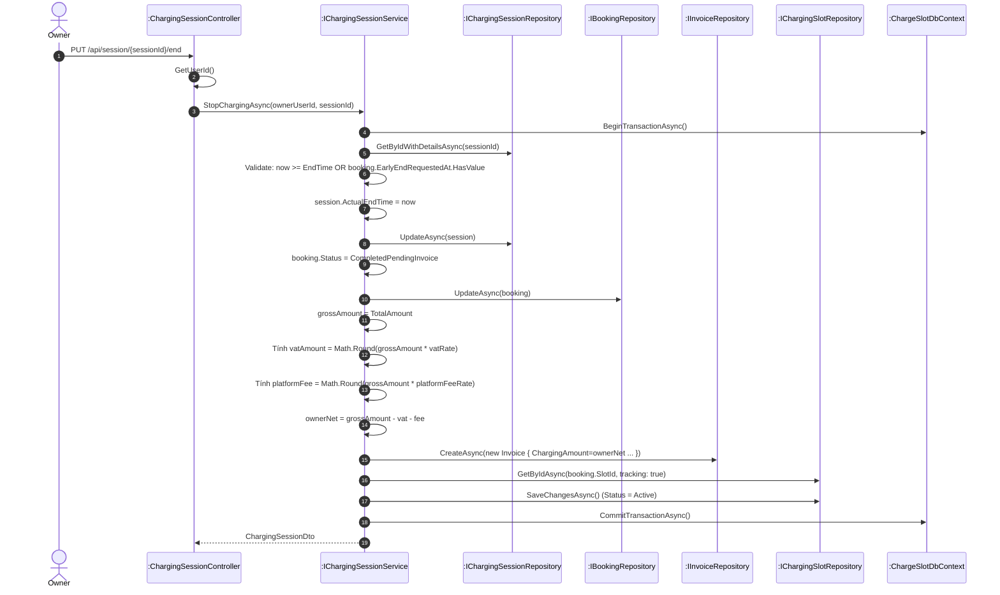
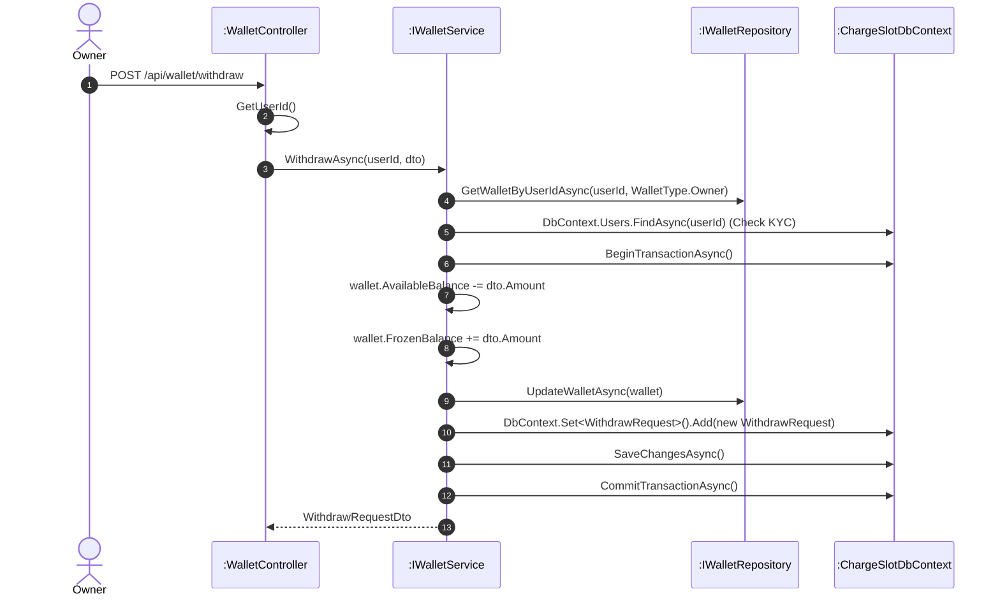

# 📸 HỆ THỐNG SƠ ĐỒ CHI TIẾT (STRICT CODE-LEVEL ARCHITECTURE)

Dưới đây là các sơ đồ tuần tự (Sequence Diagram) được trích xuất **chính xác 100% từng dòng lệnh (method calls)** từ source code hiện tại, với trật tự Layer chuẩn xác từ `Controller` -> `Service` -> `Repository` -> `DbContext`.

---

## 📅 1. TẠO HỒ SƠ ĐẶT CHỖ (CREATE BOOKING)

---

## 💳 2A. THANH TOÁN PAYMENT VIA WALLET

---

## 🏦 2B. THANH TOÁN VIETQR WEBHOOK (SEPAY)

---

## 📍 3. CHECK-IN NHẬN XE TẠI TRẠM

---

## ⚡ 4. BẮT ĐẦU SẠC (START SESSION)

---

## 🛑 5. KẾT THÚC SẠC (END SESSION)

---

## 💸 6. RÚT TIỀN VÍ (WITHDRAW REQUEST)

